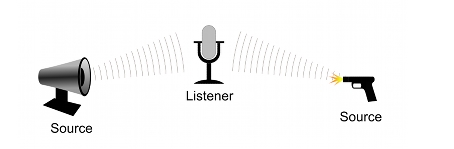
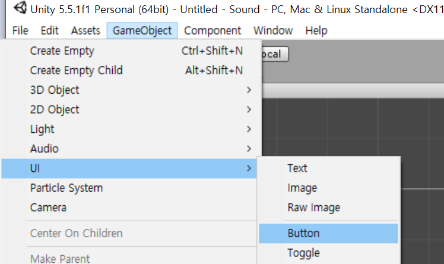
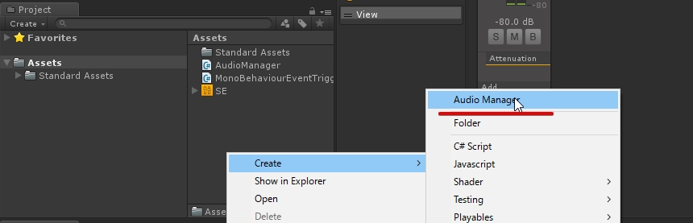
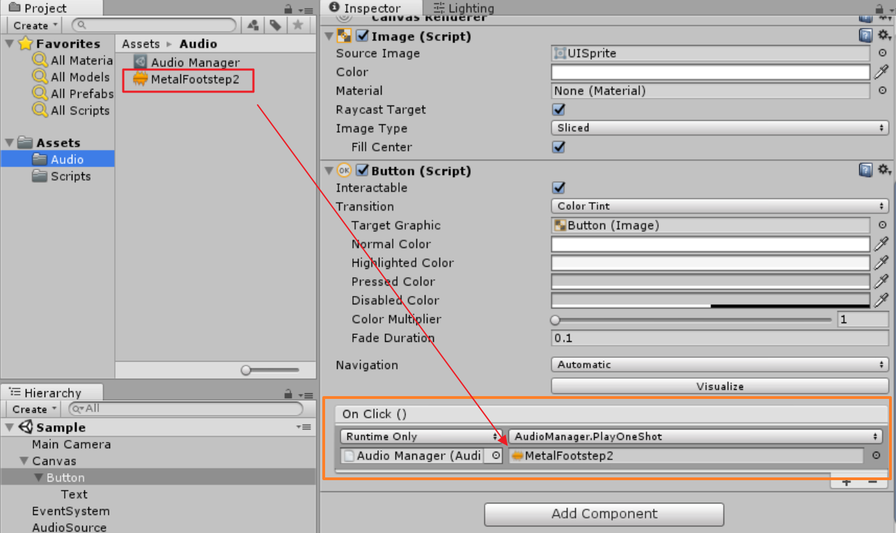

## ScriptableObject

---

## Unity Audio
- Audio Source - 스피커
- Audio Listener - 귀



---

## Sound - Unity API

AudioSource.PlayOneShot

---

Button UI 객체 생성



---

## Audio Manager

AudioManager.cs

```csharp
using  System.Collections;
using  System.Collections.Generic;
using  UnityEngine;

[CreateAssetMenu]
public class AudioManager : ScriptableObject
{
	public void PlayOneShot ( AudioClip clip )
	{
		if (audioSource! = null ) {
			audioSource.PlayOneShot (clip);
		}
	}

	public AudioSource audioSource { get ; set ;}
}
```
---

AudioiManager ScriptableObject 에셋 생성



---
## Event Trigger

MonoBehaviourEventTrigger.cs

``` csharp
using  System.Collections ;
using  System.Collections.Generic ;
using  UnityEngine ;
using  UnityEngine.Events ;

public  class  MonoBehaviourEventTrigger : MonoBehaviour
{
	public UnityEvent  onAwake = new  UnityEvent ();
	public UnityEvent  onDestroy = new  UnityEvent ();

	void  Awake ()
	{
		onAwake.Invoke ();
	}

	void  OnDestroy ()
	{
		onDestroy.Invoke ();
	}
}
```

---

AudioSource 객체 설정

1. AudioSource 컴포넌트 추가
2. AudioManager 객체 등록
3. MonoBehaviourEventTrigger의 onAwake 이벤트로 AudioManager.audioSource 설정.

<br>

<span style="color:gray; font-size:0.7em">onAwake.Invoke 함수 호출시 AudioManager.audioSource에 AudioSource(1) 객체가 할당된다.</span>

---

?image=images/audiosource.png&size=auto 70%

---

Button.OnClick 이벤트 처리



* 버튼 클릭시 AudioManager.PlayOneShot 함수가 호출.
* AudioManager.PlayOneShot 함수의 인자로 설정한 audio clip이 전달.
