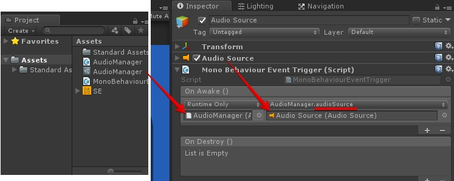
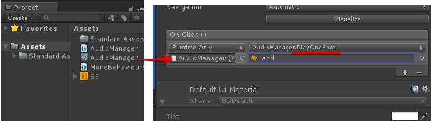

## ScriptableObject

---

## Unity Audio
- Audio Source - 스피커
- Audio Listener - 귀


---

## Sound - Unity API

AudioSource.PlayOneShot

---


## Audio Manager

AudioManager.cs

```csharp
using  System.Collections;
using  System.Collections.Generic;
using  UnityEngine;

[CreateAssetMenu]
public class AudioManager : ScriptableObject
{
	public void PlayOneShot ( AudioClip clip )
	{
		if (audioSource! = null ) {
			audioSource.PlayOneShot (clip);
		}
	}

	public AudioSource audioSource { get ; set ;}
}
```
---

AudioiManager ScriptableObject 에셋 생성


---
## Event Trigger

MonoBehaviourEventTrigger.cs

``` csharp
using  System.Collections ;
using  System.Collections.Generic ;
using  UnityEngine ;
using  UnityEngine.Events ;

public  class  MonoBehaviourEventTrigger : MonoBehaviour
{
	public UnityEvent  onAwake = new  UnityEvent ();
	public UnityEvent  onDestroy = new  UnityEvent ();

	void  Awake ()
	{
		onAwake.Invoke ();
	}

	void  OnDestroy ()
	{
		onDestroy.Invoke ();
	}
}
```

---

AudioSource 등록



그럼 AudioSource를 AudioManager에 등록하는 동작을 추가합니다.

- MonobehaviourEventTrigger.OnAwake: AudioManager를 설정
- AudioManager.audioSource: AudioSource를 설정.

AudioManager.audioSource는 속성이므로 이벤트에 사용 가능 버립니다.

---

## Button Action




- 버튼 클릭시 등록된 사운드를 출력하도록 설정.
- Button에 AudioManager를 등록.
- AudioManager의 PlayOneShot 사운드를 등록.

----
