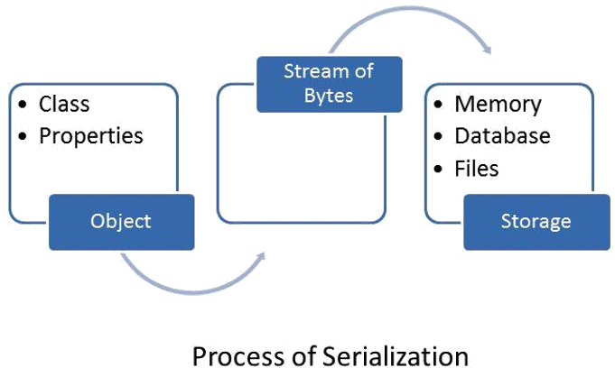
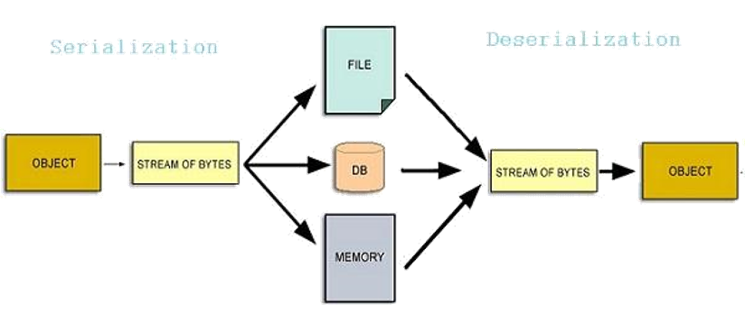

### Serialization을 활용한 데이터관리

---

* Serialization에 대한 이해
* ScriptableObject에 대한 이해
* .NET Reflection에 대한 이해
* 효율적인 데이터 관리에 대한 고찰

---

## Serialization

* 직렬화
* 객체를 메모리 바이트 형태의 스트림으로 변환
* 왜?
 * 메모리, 데이터 베이스 혹은 파일로 저장하기 위해
* 객체의 상태를 그대로 저장
 * 왜? -> 필요할 때 복원하기 위해서
* Serialization의 반대
 * Deserialization

---



---



---

게임에서의 serialization

* Save
* F2키를 누르면 현재 상태를 바로 저장


---

게임에서의 Serialization

* 무엇을?
 * 객체의 상태
* 어떻게?
 * bytes of stream
* 어디로?
 * socket

---

Unity3D의 Serialization

* Serialization - 객체의 상태를 저장
* Unity3D Class:
 * MonoBehaviour
 * GameObject
 * Transform
 * Vector3
 * Texture2D
 * …
* Scene 파일: 일종의 Seriaization

---

Unity3D의 다양한 타입을 포함하는 객체에 대한 Serialization
방법?

* 다양한 컴포넌트를 포함하는 특정 GameObject의 Serialization 기
 능
* Unity3D 엔진에서 기본적으로 지원하지 않음!
 * 하지만, 방법은 있다!

* 데이터 처리를 위한 사용자 클래스 정의와 Serialization
 * ScriptableObject 의 사용
 * 에디터 스크립트 지원

---

<span style="font-size:2.0em; font-weight:bold; color:gray">ScriptableObject</span>

---

ScriptableObject

* Unity의 Object 클래스를 상속한 클래스
* 직렬화(Serialize) 가능한 클래스

---

SciptableObject의 장점

* 데이터 관리를 획기적으로 개선
* 어셈블리의 리로딩시 인스펙터 뷰에 있는 컴포넌트의 설정 값이 사라지는 경우 발생
 * <span style="font-size:0.6em; color:gray">ScriptableObject에 값을 저장하고, 불러들이는 방법으로 해결 가능</span>
 * <span style="font-size:0.6em; color:gray">ScriptableObject의 클래스 데이터 변경시 저장된 값이 초기화</span>
 * <span style="font-size:0.6em; color:gray">값이 구글 시트나 엑셀과 같이 데이터가 외부에 있는 경우 다시 불러 오는 방법으로 해결 가능</span>
* 유니티 애셋간 복잡한 연결 정보를 저장할 때 생산성 향상
* 애셋 번들에서 다운 받은 애셋들을 조합해주는 중간 매개체 역할로 사용시 편리

---

MonoBehaviour

* 스크립트
* Unity의 콜백 호출을 받는다.
* Unity의 컴포넌트: GameObject에 추가.
* 데이터는 Scene / Prefab에 저장.
* Serialization 가능.
* Inspector에서 확인 가능.

---

ScriptableObject

* 스크립트
* Unity의 콜백 호출을 받지 않는다.
* 컴포넌트가 아니다: GameObject에 컴포넌트로 추가할 수 없다.
* 하나의 스크립트 파일, 여러 개의 인스턴스 생성.
* 각각의 인스턴스는 개별 파일로 저장 가능.  

---

MonoBehaviour와 ScriptableObject 비교

---

```csharp
public class NPCHealth : MonoBehaviour
{
    [Range(10, 100)]
    public int maxHealth;

    [Range(10, 100)]
    public int healthThreshold;

    public NPCAIStateEnum goodHealthAi;
    public NPCAIStateEnum lowHealthAi;

    [System.NonSerialized]
    public int currentHealth;
}
```

---

## 문제점

* MonoBehaviour는 Prefab혹은 Scene에 저장.
* maxHealth 수정시?
  * 여러 개의 NPCHealth 컴포넌트를 가지는 GameObject를 일일이 수정.
  * 여러 Scene 파일에 존재하는 경우?


---

* maxHealth를 관리하는 NPCHealthConfig 클래스를 작성.

``` csharp
public class NPCHealthV2 : MonoBehaviour
{
    public NPCHealthConfig config;

    [System.NonSerialized]
    public int currentHealth;
}
```

---

* 별도의 ScriptableObject로 분리하면 편리!


```csharp
[CreateAssetMenu(menuName = "Content/Health Config")]
public class NPCHealthConfig : ScriptableObject
{
  [Range(10, 100)]
  public int MaxHealth;

    [Range(10, 100)]
    public int HealthThreshold;

    public NPCAIStateEnum GoodHealthAi;
    public NPCAIStateEnum LowHealthAi;
}
```

---

Sample A

---

## Unity Audio
- Audio Source - 스피커
- Audio Listener - 귀


---

## Sound - Unity API

AudioSource.PlayOneShot

---

Button UI 객체 생성


---

## Audio Manager

AudioManager.cs

```csharp
using  System.Collections;
using  System.Collections.Generic;
using  UnityEngine;

[CreateAssetMenu]
public class AudioManager : ScriptableObject
{
	public void PlayOneShot ( AudioClip clip )
	{
		if (audioSource! = null ) {
			audioSource.PlayOneShot (clip);
		}
	}

	public AudioSource audioSource { get ; set ;}
}
```
---

AudioiManager ScriptableObject 에셋 생성


---
## Event Trigger

MonoBehaviourEventTrigger.cs

``` csharp
using  System.Collections ;
using  System.Collections.Generic ;
using  UnityEngine ;
using  UnityEngine.Events ;

public  class  MonoBehaviourEventTrigger : MonoBehaviour
{
	public UnityEvent  onAwake = new  UnityEvent ();
	public UnityEvent  onDestroy = new  UnityEvent ();

	void  Awake ()
	{
		onAwake.Invoke ();
	}

	void  OnDestroy ()
	{
		onDestroy.Invoke ();
	}
}
```

---

AudioSource 객체 설정

1. AudioSource 컴포넌트 추가
2. AudioManager 객체 등록
3. MonoBehaviourEventTrigger의 onAwake 이벤트로 AudioManager.audioSource 설정.

<br>

<span style="color:gray; font-size:0.7em">onAwake.Invoke 함수 호출시 AudioManager.audioSource에 AudioSource(1) 객체가 할당된다.</span>


---?image=images/audiosource.png&size=auto 70%

---
Button.OnClick 이벤트 처리


* 버튼 클릭시 AudioManager.PlayOneShot 함수가 호출.
* AudioManager.PlayOneShot 함수의 인자로 설정한 audio clip이 전달.

---

Sample B: 데이터 컨테이너

---

---

RPG Item

```csharp
class GameItem: ScriptableObject {
   public Sprite icon;
   public GameItemSlot slot;

    public void OnEquip(GameCharacter c) { … }
    public void OnRemove(GameCharacter c) { … }
}

class GameItemSlot: ScriptableObject {}
```

---

아이템 장착/탈착시 아이템 효과(Effect)를 적용하려면?


--

```csharp
class GameItem: ScriptableObject {
   public Sprite icon;
   public GameItemSlot slot;
   public GameItemEffect[] effects;

    public void OnEquip(GameCharacter c) {
       // Apply effects here…?
    }

    public void OnRemove(GameCharacter c) {
       // Remove effects here…?
    }
}
```

---

* 아이템 효과는 캐릭터의 스텟을 변경

```csharp
class GameItemEffect: ScriptableObject {
   public GameCharacterStat stat;
   public int statToChange;
}
```

---

Should GameItemEffect just carry data?

• What if designers want to do something other than just add stats?
  • Every effect type’s code has to go into GameItem.OnEquip

• But ScriptableObjects are just classes…

• Why not embed the logic in the GameItemEffect class itself?

---

```csharp
abstract class GameItemEffect: ScriptableObject {
   public abstract void OnEquip(GameCharacter c);
   public abstract void OnRemove(GameCharacter c);
}
```

---

GameItemEffectAddStat

```csharp
class GameItemEffectAddStat: GameItemEffect {
   public GameStat stat;
   public int amountToAdd;

    public override void OnEquip(GameCharacter c) {
       c.AddStat(statToChange, amountToAdd);
    }

    public override void OnRemove(GameCharacter c) {
       c.AddStat(statToChange, -1 * amountToAdd);
    }
}
```

---

GameItemEffectTransferStat

```csharp
class GameItemEffectTransferStat: GameItemEffect {
   public GameStat statToDecrease;
   public GameState statToIncrease;
   public int amountToTransfer;

    public override void OnEquip(GameCharacter c) {
       c.AddStat(statToReduce, -1 * amountToAdd);
       c.AddStat(statToIncrease, amountToTransfer);
    }

    public override void OnRemove(GameCharacter c) {
       c.AddStat(statToReduce, amountToAdd);
       c.AddStat(statToIncrease, -1 * amountToTransfer);
    }
}
```

---

* GameItem은 장착시 해당 아이템의 모든 효과를 적용

```csharp
class GameItem: ScriptableObject {
   public Sprite icon;
   public GameItemSlot slot;
   public GameItemEffect[] effects;

    public bool OnEquip(GameCharacter c) {
       for(int i = 0; i < effects.Length; ++i) {
           effects[i].OnEquip(c);
       }
    }

    public bool OnRemove(GameCharacter c) { … }
}
```

---

MonoBehaviour와 마찬가지로 ScriptableObject도 Inspector 뷰에 반영

---

Serializable game logic!

* 새로운 아이템 효과 추가시 GameItem 코드를 변경할 필요가 없다.
* 간단한 인터페이스: OnEquip/OnRemove
* 디자이너가 필요한 아이템의 필요한 효과를 직접 편집(Drag&Drop)

---

Serializable… delegates?

* Consider a simple enemy AI, with a few diffrent types of behavior.
* Could just pack this all into a MonoBehaviour, use an enum or variable to
  determine AI type.
* Or…


---


```csharp
class GameNPC: MonoBehaviour {
   public GameAI brain;

    void Update() {
       brain.Update(this);
    }
}

abstract class GameAI: ScriptableObject {
   abstract void Update(GameNPC me);
}
```

---


```csharp
class PassiveAI: GameAI { … }

class AggressiveAI: GameAI { … }

class FriendlyAI: GameAI { … }
```

---

코드 작성과 확장 및 테스트가 쉽다!

* Imagine our designers, later on, wanted to add an AI that would attack you
  when you attacked one of its friends.
* With this model:
  * Add a new AI type
  * Allow the designer to define an array of friends.
  * When one is attacked, set the current AI module to an AggressiveAI.
* No changes to other code or content needed!

---

So in sum…

---

ScriptableObjects are great!

* Use them to make version control easier.
* Use them to speed up data loading.
* Use them to give your designers an easier workflow.
* Use them to configure your logic via content.
